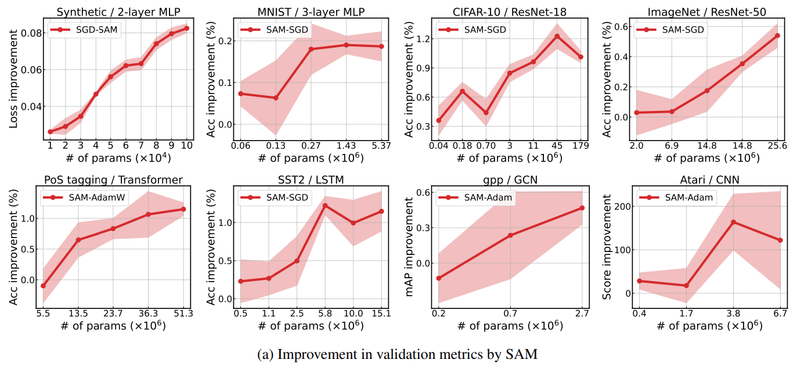

# Critical Influence of Overparameterization on Sharpness-aware Minimization

This repository contains JAX/Flax source code for reproducing key results of the UAI 2025 paper:

> **Critical Influence of Overparameterization on Sharpness-aware Minimization** \
[Sungbin Shin](https://ssbin4.github.io/)\***¹** [Dongyeop Lee](https://edong6768.github.io/)\***¹**, [Maksym Andriushchenko](https://www.andriushchenko.me/)**²**, and [Namhoon Lee](https://namhoonlee.github.io/)**¹** (*equal contribution) \
**¹** Pohang University of Science and Technology (POSTECH), **²** École Polytechnique Fédérale de Lausanne (EPFL) \
Paper: https://arxiv.org/abs/2311.17539


```bibtex
@inproceedings{shin2025critical,
  title={Critical Influence of Overparameterization on Sharpness-aware Minimization},
  author={Shin, Sungbin and Lee, Dongyeop and Andriushchenko, Maksym and Lee, Namhoon},
  booktitle={The 41th Conference on Uncertainty in Artificial Intelligence},
  year={2025}
}
```

## TL;DR

We uncover both empirical and theoretical results that indicate a critical influence of overparameterization on SAM.

## Abstract



> Training overparameterized neural networks often yields solutions with varying generalization capabilities, even when achieving similar training losses. Recent evidence indicates a strong correlation between the sharpness of a minimum and its generalization error, leading to increased interest in optimization methods that explicitly seek flatter minima for improved generalization. Despite its contemporary relevance to overparameterization, however, this sharpness-aware minimization (SAM) strategy has not been studied much yet as to exactly how it is affected by overparameterization. In this work, we analyze SAM under varying degrees of overparameterization, presenting both empirical and theoretical findings that reveal its critical influence on SAM's effectiveness. First, we conduct extensive numerical experiments across diverse domains, demonstrating that SAM consistently benefits from overparameterization. Next, we attribute this phenomenon to the interplay between the enlarged solution space and increased implicit bias resulting from overparameterization. Furthermore, we show that this effect is particularly pronounced in practical settings involving label noise and sparsity, and yet, sufficient regularization is necessary. Last but not least, we provide other theoretical insights into how overparameterization helps SAM achieve minima with more uniform Hessian moments compared to SGD, and much faster convergence at a linear rate.


## Environments

### Python
- python 3.8.0

### cuda
- cuda 11.4.4
- cudnn 8.6.0
- nccl 2.11.4

### Dependencies
```bash
pip install -r requirements.txt
```

## Usage
```bash
python main.py --workdir={logging_dir} --config={config_file}
```

Examples of the config files are located in the `configs` directory.

The degree of overparameterization is determined by `config.num_neurons` for MLP and `config.num_filters` for ResNet, while the degree of sparsification is determined by `config.sparsity`.

